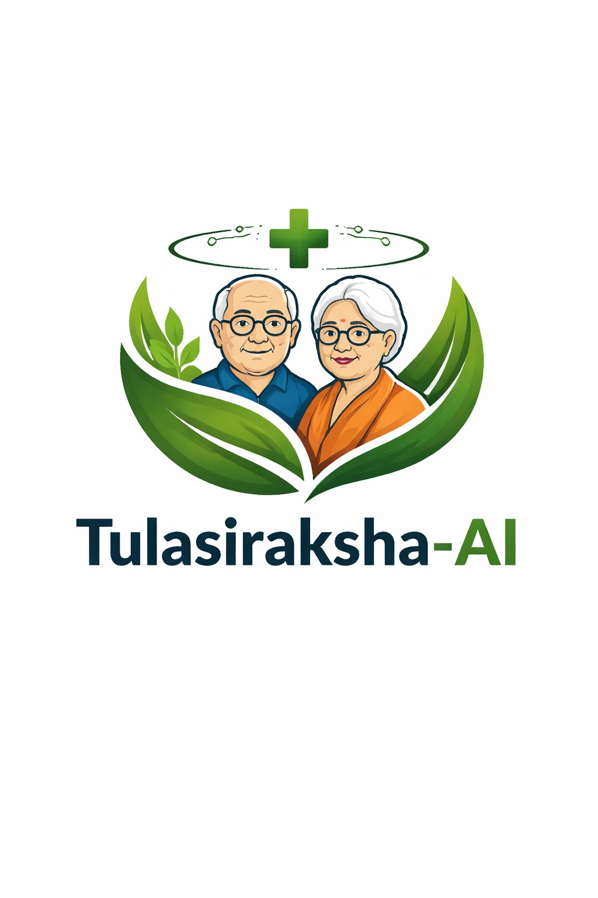

# TulsiRaksha AI

<p align="center">
  
</p>

<p align="center">
  <b>Voice-First Elder Care Assistant with Smart Health Monitoring, Family Alerts, and AI Risk Signaling</b>
</p>

## Live Deployment

- Web App: https://tulsi-raksha-ai-git-main-sudeepsbingollis-projects.vercel.app/

## Demo Video

<p align="center">
  <video src="public/home-page-vedio.mp4" controls width="900"></video>
</p>

If the video player is not visible on your browser, open the file directly: [Project Demo Video](public/home-page-vedio.mp4)

## Problem Statement

Elders and caregivers need one simple platform for daily routine tracking, voice interaction, emergency signaling, and family communication. Most current solutions are fragmented across apps and hard to use for senior citizens.

## Solution Summary

TulsiRaksha AI combines:

- Voice-guided interaction for accessibility
- Health metric tracking and risk prediction support
- Caregiver updates through WhatsApp
- Family sync and elder profile workflows
- Smartwatch + realtime data integration support

## Key Features

- Voice assistant UI for elder-friendly operation
- Multilingual support (English, Kannada, Hindi)
- Dashboard cards for heart rate, sleep, steps, and medication adherence
- Risk-aware reminders and quick actions
- Caregiver WhatsApp reporting pipeline
- Authentication with Supabase
- Optional Python ML risk service integration
- Android packaging flow through Capacitor + Appflow

## Tech Stack

- Frontend: Next.js 16, React 19
- Styling: Tailwind CSS 4
- Auth/Cloud: Supabase
- Messaging: Twilio WhatsApp API
- ML Service: Python, Flask, scikit-learn
- Mobile Packaging: Capacitor Android
- CI Packaging: Ionic Appflow

## AI/ML Models Used

### 1) Health Risk Prediction Model

- Model: RandomForestClassifier (scikit-learn)
- Training script: train_model.py
- Saved artifact: model.pkl
- Input features:
  - heart_rate
  - steps
  - sleep
  - medicine
- Output classes:
  - LOW
  - NORMAL
  - HIGH

How it is used:

- Trained in train_model.py with class balancing and 200 trees.
- Loaded through Flask API (app.py) and API bridge files for realtime risk inference.

### 2) Sentiment/Emotion Analysis Model

- Model family: face-api.js pretrained models
- Detection model: TinyFaceDetector
- Expression model: FaceExpressionNet
- Integration: app/components/EmotionDetectionPanel.jsx

How it is used:

- Webcam frames are analyzed periodically.
- Expression probabilities are mapped into user-friendly emotional states.
- Supportive-care actions are triggered via emotionContext.jsx when stress/sadness states are detected.

Note:

- This project currently uses facial expression based sentiment/emotion analysis.
- It does not currently include a separate text sentiment classifier (like VADER/BERT/TextBlob) for chat text.

### 3) Conversational AI Model

- Provider: Cohere Chat API
- Model: command-a-03-2025
- Endpoint integration: app/api/assistant/route.js

How it is used:

- Generates elder-friendly conversational responses.
- Includes fallback safe response mode when API key is not configured.

### 4) Voice Synthesis Model

- Provider: ElevenLabs
- Model: eleven_multilingual_v2
- Endpoint integration: app/api/voice/route.js and app/api/speak/route.js

How it is used:

- Converts assistant text replies to natural multilingual speech for accessibility.

## Repository Structure

```text
app/                          # Next.js App Router pages and API routes
app/components/               # UI components
app/api/                      # Server routes (voice, assistant, fitbit, whatsapp)
lib/                          # Shared utilities (supabase, twilio, voice, reports)
android/                      # Capacitor Android project
public/                       # Static assets (logo, demo video)
supabase/                     # SQL and schema support files
app.py                        # Optional Python inference service
train_model.py                # Model training script
launch_stack.py               # Full local stack launcher
```

## Quick Start

### 1) Clone and install

```bash
git clone https://github.com/SudeepSBingolli/TulsiRaksha-AI.git
cd TulsiRaksha-AI
npm install
```

### 2) Configure environment

```bash
copy .env.local.template .env.local
```

Update values in .env.local for Supabase and Twilio.

### 3) Run web app

```bash
npm run dev
```

Open http://localhost:3000

### 4) Optional Python ML API

```bash
pip install -r requirements.txt
python train_model.py
python app.py
```

## Environment Variables

Add required variables in .env.local:

```bash
NEXT_PUBLIC_SUPABASE_URL=https://your-project.supabase.co
NEXT_PUBLIC_SUPABASE_ANON_KEY=your_supabase_anon_key
TWILIO_ACCOUNT_SID=ACxxxxxxxxxxxxxxxxxxxxxxxxxxxxxxxx
TWILIO_AUTH_TOKEN=your_twilio_auth_token
TWILIO_WHATSAPP_FROM=whatsapp:+14155238886
CAREGIVER_WHATSAPP_TO=whatsapp:+919999999999
```

## NPM Scripts

- npm run dev: run local web development server
- npm run build: production build
- npm run start: run production server
- npm run lint: lint project
- npm run stack: launch integrated stack for demo/testing
- npm run cap:sync: build and sync Capacitor Android project

## API Highlights

- POST /api/assistant
- POST /api/voice
- POST /api/speak
- GET /api/health-data
- POST /api/send-whatsapp-report
- GET /api/fitbit/connect
- GET /api/fitbit/sync

## Android Build Notes (Ionic Appflow)

- Appflow configuration is in appflow.config.json
- Root gradle wrapper shim is provided at gradlew for CI compatibility
- Capacitor generated gradle files are committed for deterministic cloud builds

## Evaluation Tips for Judges

- Start with the Demo Video section
- Run npm run dev and test voice + dashboard flow
- Trigger caregiver messaging endpoint with sample data
- Run npm run stack for integrated workflow demonstration

## Additional Documentation

- [Setup Instructions](SETUP_INSTRUCTIONS.md)
- [Integration Guide](INTEGRATION_GUIDE.md)
- [Voice Setup](VOICE_SETUP.md)
- [Vercel Deployment](VERCEL_DEPLOYMENT.md)
- [Architecture](INTEGRATION_ARCHITECTURE.md)

## Team

Team Code Smashers

## License

MIT License
